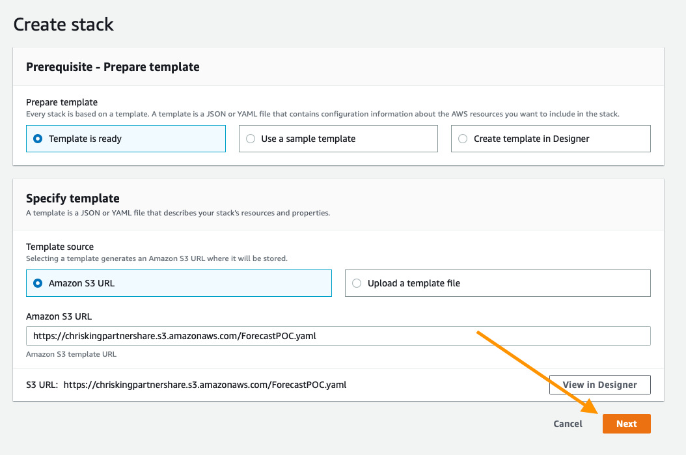
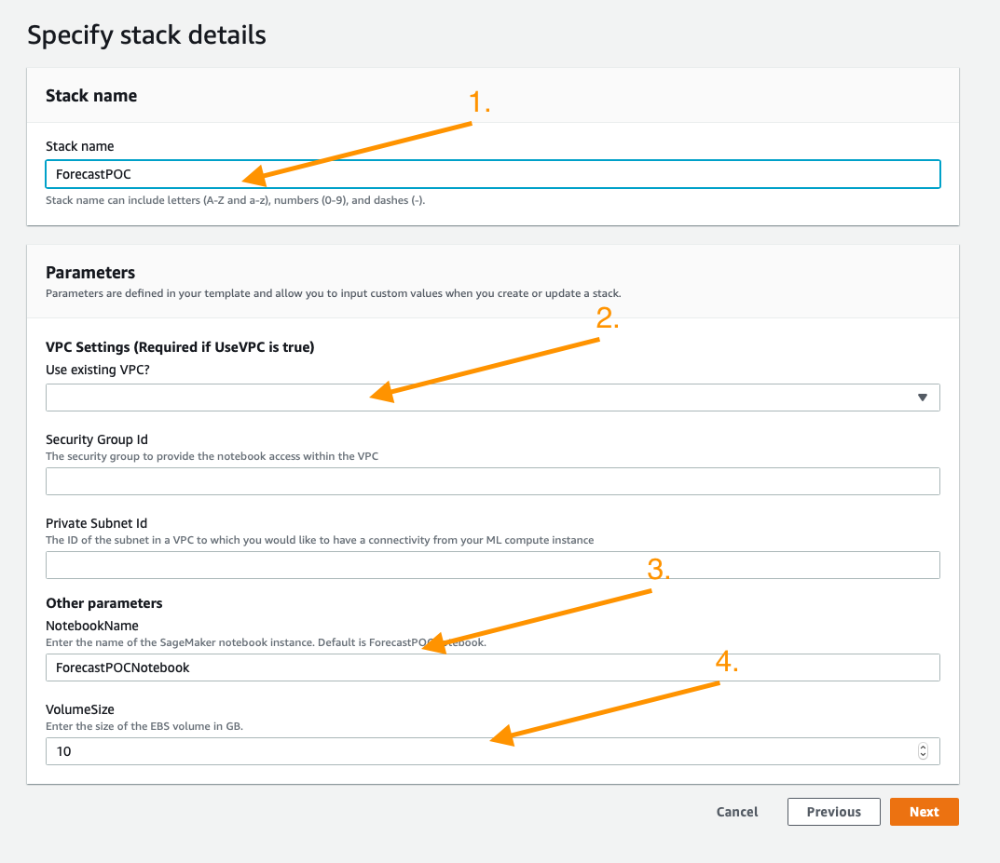
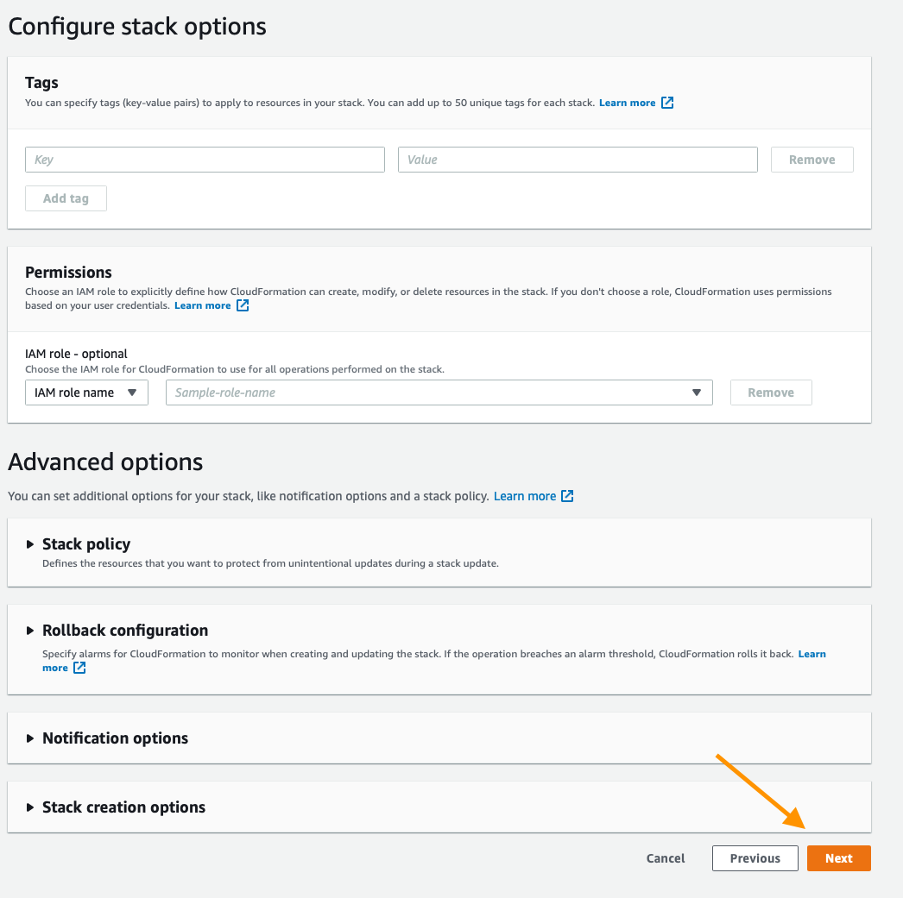
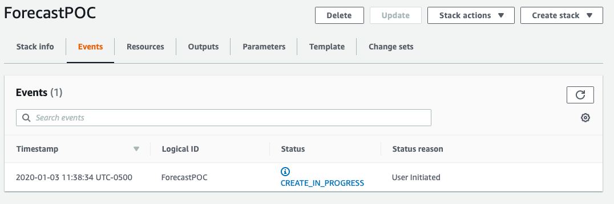
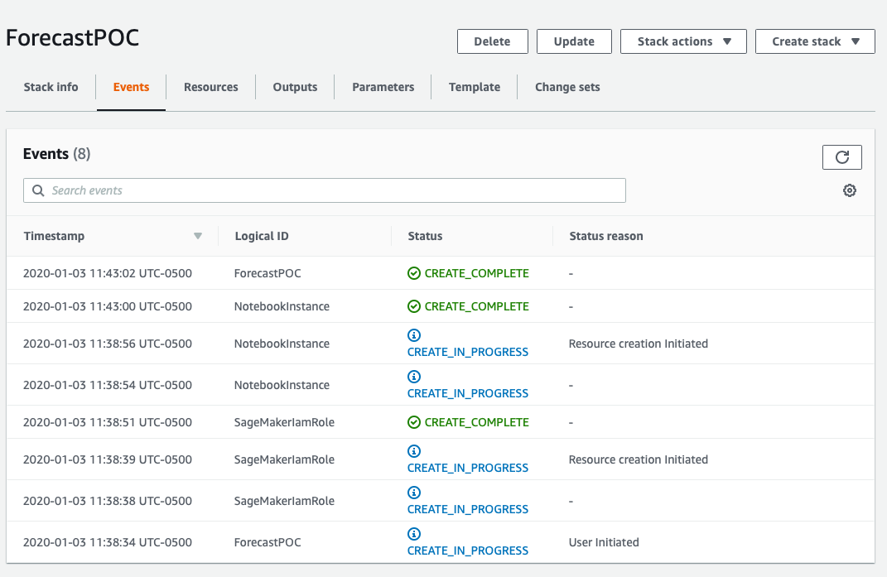
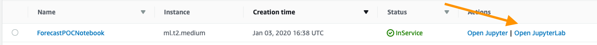

# Personalize POC Guide

Amazon Personalize is a machine learning service that allows you to build and scale recommendation/personalization models in a quick and effective manner. The content below is designed to help you build out your first models for your given use case and makes assumptions that your data may not yet be in an ideal format for Amazon Personalize to use.

This repository assumes a base familiarity with the service and if you have not already done so it is recommended that you use the getting-started material below.

## Introduction to Amazon Personalize

If you are not familiar with Amazon Personalize you can learn more about this tool on these pages:

* [Product Page](https://aws.amazon.com/personalize/)
* [GitHub Sample Notebooks](https://github.com/aws-samples/amazon-personalize-samples)
* [Product Docs](https://docs.aws.amazon.com/personalize/latest/dg/what-is-personalize.html)

## Completed Example

The notebooks have been scrubbed of all output before usage, however if you'd like to see a fully worked out example of this process, explore the notebooks in the `completed` folder.

## Process:

1. Deploying Your Working Environment
1. Validating and Importing User-Item-Interaction Data
1. Validating and Importing Item-Metadata (Optional)
1. Creating and Evaluating Your First Solutions
1. Deploying Your Campaigns and Interacting With Personalize
1. Importing Item / User metadata to Use
1. Creating and Evaluating Related Metadata Solutions (Optional)
1. Next Steps

That is a genereal order to this proccess, however if you are operating this as an assisted 2 day on-site POC. It is recommended that you operate steps 2 and 4 beforehand. Once the related data has been successfully imported you can delete it so that it does not muddy the results from your first Predictor.

## Deploying Your Working Environment

As mentioned above, the first step is to deploy a CloudFormation template that will perform much of the initial setup work for you. In another browser window or tab, login to your AWS account. Once you have done that, open the link below in a new tab to start the process of deploying the items you need via CloudFormation.

Follow along with the screenshots below if you have any questions about deploying the stack.

### Cloud Formation Wizard

Start by clicking `Next` at the bottom like this:

On this page you have a few tasks:

1. Change the Stack name to something relevant like `ForecastPOC`
2. Decide if you want to use an existing VPC or not
3. Change the Notebook Name (Optional)
4. Alter the VolumeSize for the SageMaker EBS volume, default is 10GB, if your dataset is expected to be larger, please increase this accordingly.

When you are done click `Next` at the bottom.

This page is a bit longer so scroll to the bottom to click `Next`. All of the defaults should be sufficient to complete the POC, if you have custom requirements alter as necessary.

Again scroll to the bottom, check the box to enable the template to create new IAM resources and then click `Create Stack`.

For a few minutes CloudFormation will be creating the resources described above on your behalf it will look like this while it is provisioning:

Once it has completed you'll see green text like below indicating that the work has been completed:

Now that your environment has been created go to the service page for Sageamaker by clicking `Services` in the top of the console and then searching for `SageMaker` and clicking the service.

From the SageMaker console scroll until you see the green box indicating now many notebooks you have in service and click that.

On this page you will see a list of any SageMaker notebooks you have running, simply click the `Open JupyterLab` link on the Forecast POC notebook you have created

This will open the Jupyter environment for your POC, think of it as a web based data science IDE if you are not familiar with it. It should Automatically open the `ForecastPOC` folder for you, but if it does not do that by clicking on the folder icon in the browser on the left side of the screen and follow the documentation below to get started with your POC!

## Validating and Importing User-Item-Interaction Data

The core data for every algorithm supported in Amazon Personalize is User-Item-Interaction data, this notebook will guide you through the process of identifying this data, then formatting it for the service, defining your schema, and lastly importing it. 

Open `Validating_and_Importing_User_Item_Interaction_Data.ipynb` and follow along there.

Once you have completed this, you can move onto the Item and User Metadata sections.

## Validating and Importing Item Metadata [Optional]

Amazon Personalize has several algorithms that can give you a result with no metadata. However the HRNN-Metadata Algorithm might be an interestesting resource to deploy given your dataset. In case it is there is an optional item metadata notebook below. It is similar to the process for users and the only algorithm that supports either data type is HRNN-Metadata.

Open `Validating_and_Importing_Item_Metadata.ipynb` and follow along there to prepare the dataset for the POC/Amazon Forecast.

## Creating and Evaluating Your First Solutions

In Amazon Personalize there is a concept of a Solution, this is a trained model based on the data that you've provided to the service. All models are private and no data occurs between accounts or even Dataset Groups. This notebook will guide you through the process of training models aka building a solution for:

* HRNN
* SIMS
* Personalized-Ranking

Something you may notice is that each of these algorithms or recipies solves a critically different problem, the goal is to show you how to build things that address a host of problems from a relatively simple dataset.
Open `Creating_and_Evaluating_Solutions.ipynb` and follow along to build these Solutions and see their results.
